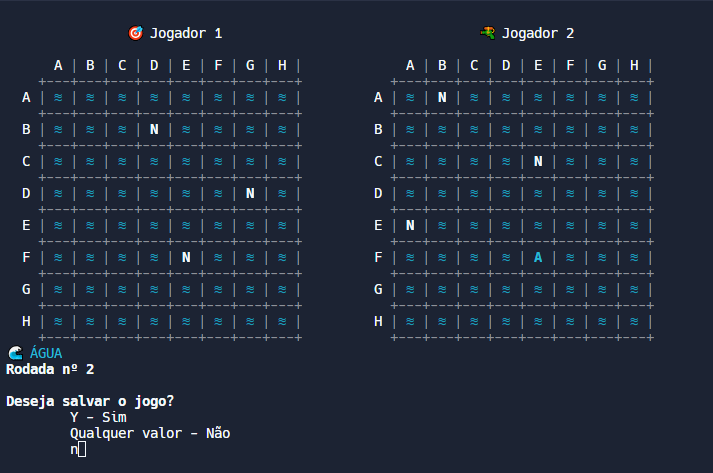

# Batalha Naval (Algoritmo e Programação Estruturada)
## Made by:
- Alessandro ([@alessandrojunior1](https://github.com/alessandrojunior1
)),
- Alex ([@SunsettingAlex](https://github.com/SunsettingAlex)),
- Bruno ([@ebrunovs](https://github.com/ebrunovs)),
- Caio Soares ([@caiosoares1](https://github.com/caiosoares1)),
- Carlos André ([@jovemcarlosti](https://github.com/JovemCarlosTI)) 

Este é o projeto prático final realizado para a disciplina de Algoritmo e Programação Estruturada do CST em Sistemas para Internet no Instituto Federal de Educação, Ciência e Tecnologia da Paraíba (IFPB)

Para visualizar o projeto, acesse pelo [link do replit](https://replit.com/@CarlosAndre34/Batalha-Naval-Projeto-Final-APE)!